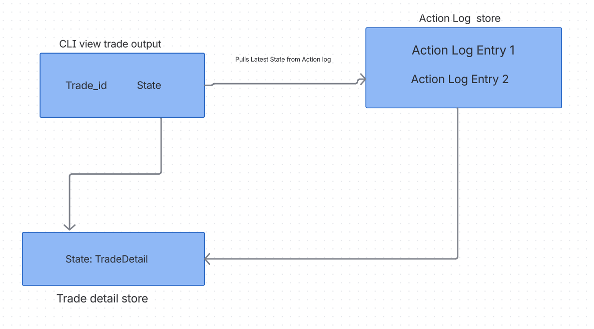

## Overview
Here are some points I'd like to outline for this case study in terms of:
- assumptions 
- code design
- use of ai
- improvements in a production standard

## Assumptions
- I assumed validating a user would not be required for this case study so any user_id can be passed when submitting and reused as the trade goes through the process
- Action logging begins once a trade has been at least submitted

## Code Design
All storage for both trade details and action logs are stored in memory and are wiped between container builds (although we could persist state by adding a bind mount to local machine memory potentially). I used docker to abstract the inconvenience of setting up your own environment when cloning the repo.

I used a dictionary to store both trade_details per trade and a list of action logs per trade, e.g., trade with id of 1 would give a dictionary where each key is a state of that trade and its value being a trade detail. Trade with id of 1 would give a list with each element being an action log that was recorded as a trade goes through its states. The CLI tool's view_trades can see the latest step of each trade that has been at least submitted.

## Use of AI
As this was outlined in the requirements I can safely say that for coding the library api and deeper classes, all logic was planned by me but I did use chatgpt to see a general skeleton of how a class might look as a guide. The cli tool in main.py I initially started coding myself using argparse as I've used this before but I did use chatgpt to fill the details of some of the parsers to accommodate the range of api methods available.
I wanted to add a cli client to begin with since this library isn't being used as a webapp or gRPC service in this context.

I used AI a lot to generate documentation for this project as I wanted to be as clear and concise to somebody else reading this but still reviewed what was generated heavily to see if it made sense.

## Improvements in a production standard

### Database
I think a relational database would be a good fit to persist trades and action logs if the rate of trade drafts being created was being done from a private perspective with stakeholders being quants working at a hedge fund since this api wouldn't be available for public consumption. If the data is predictable with the same fields across all trade requests I would back using this type of database. If complex analysis of trade data was also required, the toolset of queries offered by databases like PostgreSQL or MySQL could be appropriate.

### gRPC
A gRPC wrapper could be easily used to encapsulate the api specified in order for a client to consume this service be platform independent keeping in mind that data would need to be persisted as I've mentioned above.

